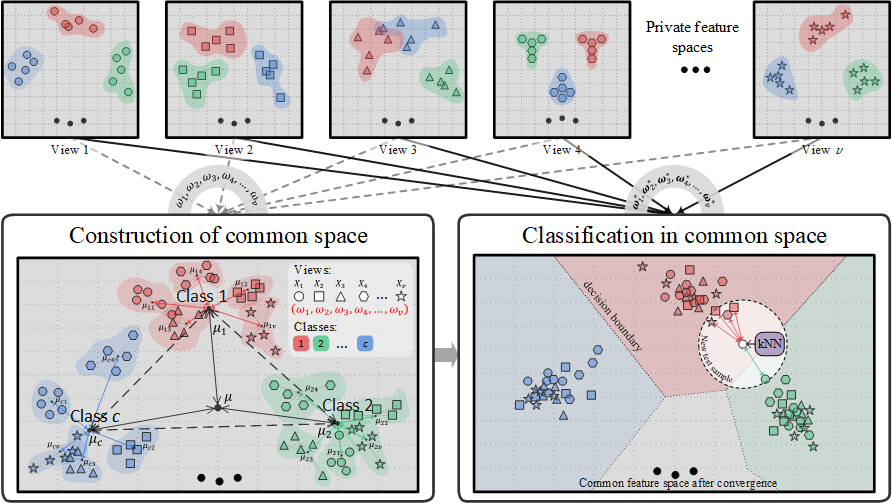
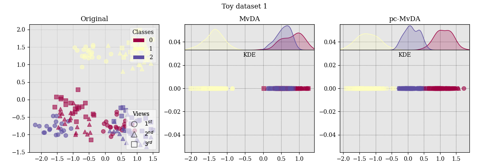
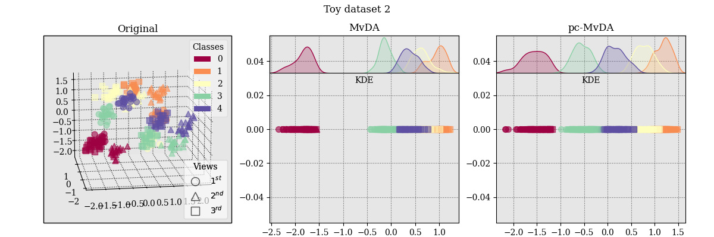

# Pairwise-Covariance Multi-view Discriminant Analysis

This repo contains code of our paper proposing the algorithm.


*More infos will be added later.*

### Installation

This project depends on `torchsl` package, which is under development and will be separated into independent repository
soon. The package reimplements some subspace learning algorithms in PyTorch. To install C++ extension, use these
commands (requires C++ compiler):

```terminal
cd torchsl
python setup.py build_ext --inplace
pip install .
```

Nevertheless, the package works without C++ extension, but in python speed.

### Usage

The `torchsl` package tries to offer another perspective of subspace learning algorithm. Generally, there are two main
components of an algorithm:

- *The linear projector* can be viewed as a single Linear layer without bias, packaged in `torchsl.nn.Linear` (
  single-view) and `torchsl.nn.Linears` (multi-view).
- *The solver* that assign weight to the projector, either analytically (e.g. the new `torchsl.optim.GEPSolver` for
  solving Generalized Eigenvalue Problem) or iteratively (e.g. the conventional `torch.optim.SGD`).

From that observation, we can interprete machine learning algorithms in familiar PyTorch's paradigm. The package aims to
create a base for Python developers who are researching subspace learning algorithms in our lab, deobfuscate Matlab code
and bring them to light.

#### MvDA(-vc)

MvDA uses an analytical optimizer that assigns weights to the projecter only once. If we set `alpha_vc=0`, the
view-consistency term will be ignored.

```python
import torchsl
from torchsl.utils.data.synthetics import make_multiview_blobs

Xs, y = make_multiview_blobs()

projector = torchsl.nn.Linears([X.size(1) for X in Xs], 1, requires_grad=False)
optim = torchsl.optim.GEPSolver(projector.parameters(), solver='svd')

# compute scatter matrices
Sw, Sb = torchsl.mvda(Xs, y, alpha_vc=0.1)
optim.step(Sw, Sb)

Ys = projector(Xs)
```

#### pc-MvDA

The proposed objective is non-convex and has no analytical solution. Instead, it acts like a Loss Function over
transformed data `Ys` and is solved iteratively with conventional Gradient Descent optimizers. The local optima highly
depends on initialization of projector, therefore, it is recommended that we initialize pc-MvDA with MvDA.

```python
import torch
import torchsl
from torchsl.utils.data.synthetics import make_multiview_blobs

Xs, y = make_multiview_blobs()

projector = torchsl.nn.Linears([X.size(1) for X in Xs], 1, requires_grad=True)
optim = torch.optim.Adam(projector.parameters(), lr=1e-2)

# training loop
for epoch_id in range(200):
    optim.zero_grad()
    Ys = projector(Xs)
    loss = torchsl.pcmvda_loss(Ys, y)
    loss.backward(retain_graph=True)
    optim.step()

projector.requires_grad_(False)
Ys = projector(Xs)
```

### Example

Run `main_synthetic.py` to reproduce the ablation study on synthetic datasets presented in our paper. The code for the
beautiful scatter plots is also included.

- Synthetic dataset 1:
  
- Synthetic dataset 2:
  
  You can change the generation parameters to see more results.

### Note

*This code is subject to change in the future*
